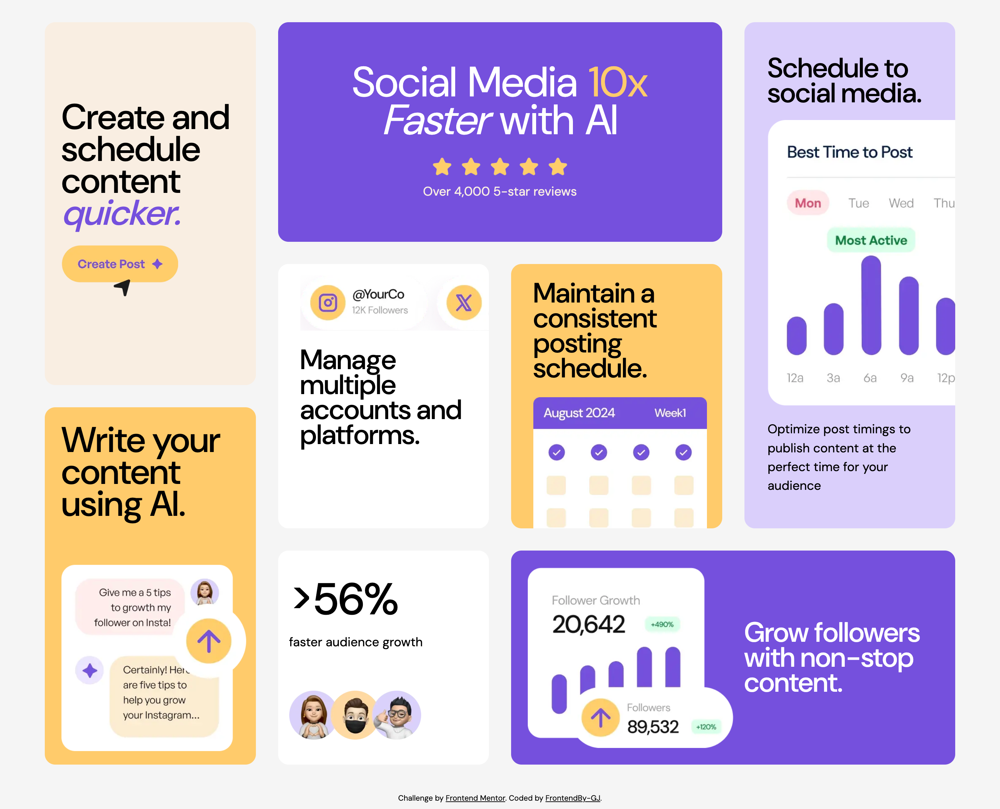

# Frontend Mentor - Bento grid solution

This is a solution to the [Bento grid challenge on Frontend Mentor](https://www.frontendmentor.io/challenges/bento-grid-RMydElrlOj). Frontend Mentor challenges help you improve your coding skills by building realistic projects.

## Table of contents

- [Overview](#overview)
  - [The challenge](#the-challenge)
  - [Screenshot](#screenshot)
  - [Links](#links)
- [My process](#my-process)
  - [Built with](#built-with)
- [Author](#author)

## Overview

### The challenge

Users should be able to:

- View the optimal layout for the interface depending on their device's screen size

### Screenshot

### Links

- Solution URL: [https://www.frontendmentor.io/solutions/responsive-bento-grid-0FWyekPbsN](https://www.frontendmentor.io/solutions/responsive-bento-grid-0FWyekPbsN)
- Live Site URL: [https://frontendby-gj-bento-grid.netlify.app](https://frontendby-gj-bento-grid.netlify.app)

## My process

### Built with

- Semantic HTML5 markup
- CSS custom properties
- CSS Grid
- Mobile-first workflow
- [React](https://reactjs.org/) - JS library
- [Sass](https://sass-lang.com/) - For styles
- [Vite](https://vitejs.dev/) - Frontend

## Author

- Portfolio - [https://garciadev.netlify.app/](https://garciadev.netlify.app/)
- Frontend Mentor - [@FrontendBy-GJ](https://www.frontendmentor.io/profile/FrontendBy-GJ)
